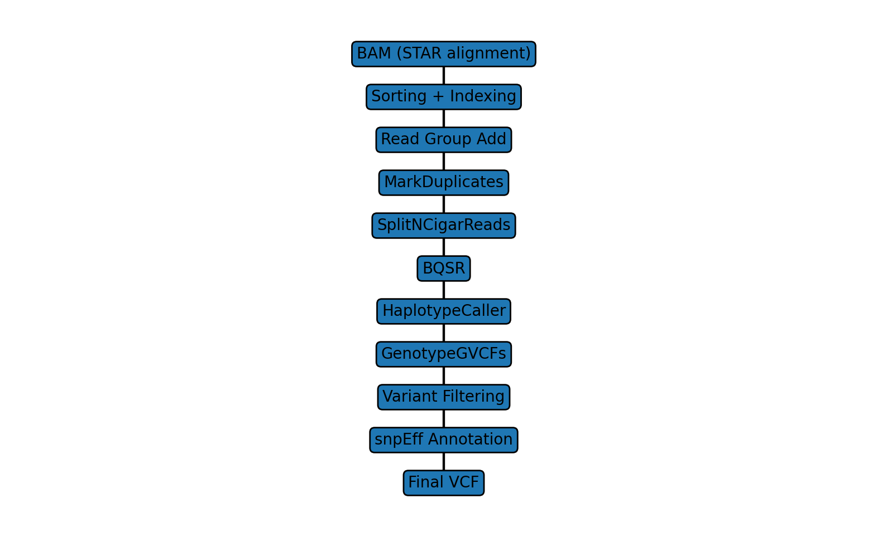

# RNA-seq Variant Calling and Functional Annotation Pipeline

A reproducible bioinformatics pipeline for RNA-seq variant discovery, filtering, and functional annotation using GATK, bcftools, and snpEff.

This workflow follows GATK best practices adapted for RNA-seq data, including preprocessing, base quality score recalibration (BQSR), variant calling, filtering, and downstream functional annotation.

---

## 🧬 Overview

This pipeline processes RNA-seq aligned BAM files to identify high-confidence genetic variants and annotate their functional impact.



### Workflow Summary
BAM  
↓  
Sorting  
↓  
Read Group Assignment  
↓  
MarkDuplicates  
↓  
SplitNCigarReads (RNA-seq specific)  
↓  
Base Quality Score Recalibration (BQSR)  
↓  
HaplotypeCaller (GATK)  
↓  
Genotyping (GenotypeGVCFs)  
↓  
Variant Filtering (SNP/Indel separation + hard filtering)  
↓  
Functional Annotation (snpEff)  
↓  
Final annotated VCF  


---

## 🛠️ Tools & Versions

- GATK: 4.6.2.0
- samtools: >=1.15
- bcftools: >=1.15
- snpEff: 113
- Java: 11 or 17
- WSL2 / Ubuntu environment

---

## 📦 Installation

### 1. Install dependencies (Ubuntu / WSL)

```bash
sudo apt update && sudo apt upgrade -y

sudo apt install -y \
    samtools \
    bcftools \
    wget \
    openjdk-11-jdk \
    python3
```
### 2. Install GATK

Download from:
https://github.com/broadinstitute/gatk/releases

Add to PATH:
```bash
echo 'export PATH=/path/to/gatk:$PATH' >> ~/.bashrc
source ~/.bashrc
```

---

## 📁 Repository Structure
```text
rna-seq-variant-calling-pipeline/
│
├── pipeline/              # Main workflow scripts
│   ├── 01_alignment_preprocess.sh
│   ├── 02_bqsr.sh
│   ├── 03_variant_calling.sh
│   ├── 04_filtering.sh
│   └── 05_annotation_snpeff.sh
│
├── environment/           # Environment setup notes
├── config/                # Configuration files (paths, chr mapping)
├── results/               # Output files (VCF, tables)
├── figures/               # Pipeline diagrams / figures
│
└── README.md
```
---

## 🚀 Usage

### Step 1: Preprocessing
```bash
bash pipeline/01_alignment_preprocess.sh
```

### Step 2: Base Quality Recalibration
```bash
bash pipeline/02_bqsr.sh
```

### Step 3: Variant Calling
```bash
bash pipeline/03_variant_calling.sh
```

### Step 4: Variant filtering
```bash
bash pipeline/04_filtering.sh
```

### Step 5: Functional annotation
```bash
bash pipeline/05_annotation_snpeff.sh
```

---

## 📊 Output

Final output includes:
- High-confidence filtered VCF
- Functional annotations (missense, nonsense, splice-site, etc.)
- Gene-level variant annotations
- snpEff summary report

---

## 🔬 Key Features
- RNA-seq aware variant calling (SplitNCigarReads enabled)
- GATK best-practice adapted pipeline
- Hard-filtering strategy for SNPs and Indels
- Functional annotation using Ensembl-based snpEff database
- Fully reproducible modular scripts

---

## 📌 Example Filtering Criteria

### SNP filtering
- QD < 2.0
- FS > 30.0
- MQ < 40.0
- MQRankSum < -12.5
- ReadPosRankSum < -8.0

### Indel filtering
- QD < 2.0
- FS > 200.0
- ReadPosRankSum < -20.0

---

## Directory Structure

Before running the pipeline:

~/reference/
├── hg38.fa
├── hg38.dict
├── hg38.fa.fai
└── 00-All.chr.vcf.gz
---

## 🧬 Biological Context

This pipeline was used to identify somatic or treatment-associated variants in RNA-seq datasets and compare variant profiles between conditions (e.g., resistant vs parental clones).

---
## 📌 Citation

If you use this pipeline, please cite this repository:
```bash
Lee, C.-I. (2026). RNA-seq Variant Calling and Functional Annotation Pipeline. GitHub. https://github.com/ka-i-rkdml/RNA-Seq-Variant-Calling-Pipeline
```

---

### ⚠️ Notes
- Designed for WSL2 / Linux environment
- Requires sufficient RAM (≥16GB recommended for GATK steps)
- Ensure reference genome consistency across all steps (hg38 recommended)
